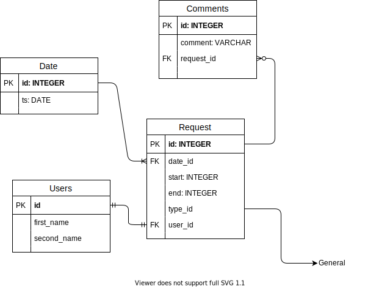

# Time manager

## Development

### Docker

All dependencies can be installed inside a docker container, the code can also
run inside a Docker container. That allows to keep local workstation clean and
at the same time development takes place on a local pc
(see [volumes](https://docs.docker.com/storage/volumes/) for more details).

Following commands will build and set up required containers:

```console
docker-compose up --build
docker-compose run dev python3 manage.py migrate
docker-compose run dev python3 manage.py createsuperuser
```

*Remote debugging* is possible via [ptvsd](https://github.com/microsoft/ptvsd)
(run `pip install ptvsd` locally). And then the debugger can be attached to
`localhost:3000`

## Database schema

